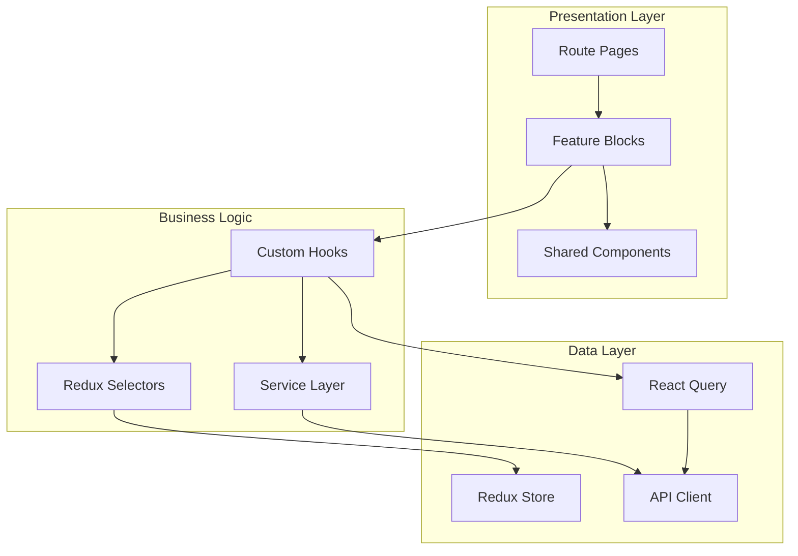

# Record Linker Frontend - Implementation Plan

**Goal**: Build a production-grade React frontend for the Record Linker data reconciliation portal, connecting external entity profiles to Wikidata items.

---

## Technology Stack

- **Build**: Vite + React 19 + TypeScript (strict mode)
- **Routing**: TanStack Router
- **State**: Redux Toolkit + React Query
- **UI**: shadcn/ui + Tailwind CSS
- **Validation**: Zod (API schemas)
- **Testing**: Vitest + React Testing Library
- **Type Checking**: `tsc --noEmit` in CI/pre-commit

> [!NOTE]
> **Scope**: Desktop-first (matching interfaces responsive). No auth for now (prepared). i18n structure only.

---

## Architecture Overview



---

## Proposed Directory Structure

```
src/
├── app/
│   ├── App.tsx
│   ├── main.tsx
│   ├── router.tsx
│   └── store.ts
├── components/
│   ├── ui/                    # shadcn components
│   ├── common/                # LoadingSpinner, ErrorBoundary, EmptyState
│   └── layout/                # AppShell, Sidebar, Header, PageContainer
├── features/
│   ├── datasets/
│   │   ├── components/
│   │   ├── pages/
│   │   ├── hooks/
│   │   └── services/
│   ├── projects/
│   │   ├── components/
│   │   ├── pages/
│   │   ├── hooks/
│   │   └── services/
│   ├── tasks/
│   │   ├── components/
│   │   ├── hooks/
│   │   └── services/
│   ├── candidates/
│   │   ├── components/
│   │   ├── hooks/
│   │   └── services/
│   └── properties/
│       ├── components/
│       ├── pages/
│       ├── hooks/
│       └── services/
├── services/
│   └── api/
│       ├── client.ts          # HTTP client wrapper
│       ├── errors.ts          # Custom error classes
│       ├── schemas/           # Zod schemas for API validation
│       │   ├── datasets.schema.ts
│       │   ├── projects.schema.ts
│       │   ├── tasks.schema.ts
│       │   └── candidates.schema.ts
│       └── types.ts           # Inferred types from Zod schemas
├── store/
│   ├── index.ts
│   ├── hooks.ts               # useAppDispatch, useAppSelector
│   └── slices/
│       ├── appSlice.ts        # Global app state
│       └── uiSlice.ts         # UI preferences
├── hooks/                     # Global hooks
├── lib/
│   ├── utils.ts               # cn() helper
│   ├── storage.ts             # localStorage wrapper
│   └── wikidata.ts            # Wikidata API + caching
├── config/
│   └── index.ts
└── styles/
    └── globals.css
```

---

## Proposed Changes

### Phase 1: Project Foundation

#### [NEW] Project scaffolding
- Initialize with `pnpm create vite@latest ./ --template react-ts`
- Configure `vite.config.ts` with proxy to `/api`
- Set up path aliases (`@/` → `src/`)

#### [NEW] [vite.config.ts](file:///c:/dev/dev_experiments/2025-12-24-antigravity-record-linker-frontend/vite.config.ts)
```typescript
server: {
  proxy: {
    '/api': {
      target: 'http://localhost:8000',
      changeOrigin: true,
    }
  }
}
```

#### [NEW] Dependencies
```json
{
  "@tanstack/react-router": "^1.x",
  "@tanstack/react-query": "^5.x",
  "@reduxjs/toolkit": "^2.x",
  "react-redux": "^9.x",
  "clsx": "^2.x",
  "tailwind-merge": "^2.x",
  "lucide-react": "^0.x",
  "react-hook-form": "^7.x",
  "zod": "^3.x",
  "papaparse": "^5.x"
}
```

---

### Phase 2: Core Infrastructure

#### [NEW] [src/services/api/client.ts](file:///c:/dev/dev_experiments/2025-12-24-antigravity-record-linker-frontend/src/services/api/client.ts)
HTTP client with:
- Base URL from config (`/api/v1`)
- Automatic JSON serialization
- Query parameter handling
- Error normalization to `ApiError` class
- Future auth header injection point

#### [NEW] [src/services/api/errors.ts](file:///c:/dev/dev_experiments/2025-12-24-antigravity-record-linker-frontend/src/services/api/errors.ts)
Custom error classes: `ApiError`, `NetworkError`, `ValidationError`

#### [NEW] Zod Schema Validation Layer
All API responses are validated with Zod schemas to catch backend contract violations early:
- `src/services/api/schemas/*.schema.ts` - Schema definitions
- Automatic type inference: `type DatasetRead = z.infer<typeof DatasetReadSchema>`
- Runtime validation in HTTP client with clear error messages

#### [NEW] Feature service files
Each feature gets a service file that maps to API endpoints:
- `src/features/datasets/services/datasets.service.ts` → `/datasets`, `/entries`
- `src/features/projects/services/projects.service.ts` → `/projects`
- `src/features/tasks/services/tasks.service.ts` → `/tasks`
- `src/features/candidates/services/candidates.service.ts` → `/candidates`
- `src/features/properties/services/properties.service.ts` → `/properties`

#### [NEW] [src/lib/wikidata.ts](file:///c:/dev/dev_experiments/2025-12-24-antigravity-record-linker-frontend/src/lib/wikidata.ts)
Wikidata API client with localStorage caching for labels/descriptions.

#### [NEW] [src/store/slices/uiSlice.ts](file:///c:/dev/dev_experiments/2025-12-24-antigravity-record-linker-frontend/src/store/slices/uiSlice.ts)
UI preferences: sidebar collapsed, theme preference, etc.

---

### Phase 3: Dataset Management

#### [NEW] [src/features/datasets/pages/DatasetsListPage.tsx](file:///c:/dev/dev_experiments/2025-12-24-antigravity-record-linker-frontend/src/features/datasets/pages/DatasetsListPage.tsx)
- Paginated table of datasets
- Create dataset button → dialog
- Search/filter by name

#### [NEW] [src/features/datasets/pages/DatasetDetailPage.tsx](file:///c:/dev/dev_experiments/2025-12-24-antigravity-record-linker-frontend/src/features/datasets/pages/DatasetDetailPage.tsx)
- Dataset metadata display/edit
- Tabbed interface: Entries | Import | Settings
- Entry count, last synced

#### [NEW] [src/features/datasets/components/EntryImportWizard.tsx](file:///c:/dev/dev_experiments/2025-12-24-antigravity-record-linker-frontend/src/features/datasets/components/EntryImportWizard.tsx)
Multi-step import:
1. File upload (CSV/JSON)
2. Column mapping preview
3. Validation summary
4. Confirmation & import

#### [NEW] [src/features/datasets/components/EntryTable.tsx](file:///c:/dev/dev_experiments/2025-12-24-antigravity-record-linker-frontend/src/features/datasets/components/EntryTable.tsx)
Paginated table with:
- Display name, external ID, external URL
- Expandable row for raw_data (table format)

#### [NEW] [src/features/properties/pages/PropertiesPage.tsx](file:///c:/dev/dev_experiments/2025-12-24-antigravity-record-linker-frontend/src/features/properties/pages/PropertiesPage.tsx)
CRUD for global property definitions.

---

### Phase 4: Project Management

#### [NEW] [src/features/projects/pages/ProjectsListPage.tsx](file:///c:/dev/dev_experiments/2025-12-24-antigravity-record-linker-frontend/src/features/projects/pages/ProjectsListPage.tsx)
- Paginated table with progress indicators
- Status badges
- Quick actions (start, view)

#### [NEW] [src/features/projects/pages/ProjectDetailPage.tsx](file:///c:/dev/dev_experiments/2025-12-24-antigravity-record-linker-frontend/src/features/projects/pages/ProjectDetailPage.tsx)
- Overview tab: stats, progress chart
- Tasks tab: filter by status, navigate to workspace
- Settings tab: name, status change, config

#### [NEW] [src/features/projects/components/ProjectStatsCard.tsx](file:///c:/dev/dev_experiments/2025-12-24-antigravity-record-linker-frontend/src/features/projects/components/ProjectStatsCard.tsx)
Display `ProjectStatsResponse`: task counts, progress %, avg score.

#### [NEW] [src/features/projects/pages/ProjectSettingsPage.tsx](file:///c:/dev/dev_experiments/2025-12-24-antigravity-record-linker-frontend/src/features/projects/pages/ProjectSettingsPage.tsx)
- Edit project name/description
- Status dropdown (manual control per Q5)
- Config JSON editor

---

### Phase 5: Reconciliation Workspace (Addrify-style)

#### [NEW] [src/features/tasks/pages/WorkspacePage.tsx](file:///c:/dev/dev_experiments/2025-12-24-antigravity-record-linker-frontend/src/features/tasks/pages/WorkspacePage.tsx)
Main reconciliation interface with layout:
```
┌─────────────────────────────────────────────────────────────┐
│ Header: Project Name | Progress                              │
├────────────────┬────────────────────────────────────────────┤
│ [Filter Tasks] │ Task Detail Panel                          │
│ ───────────────│ ┌──────────────────────────────────────┐   │
│ Task List      │ │ Entry Info (name, raw_data table)     │   │
│ [Task 1] ●     │ ├──────────────────────────────────────┤   │
│ [Task 2]       │ │ Candidates List                       │   │
│ [Task 3]       │ │ ┌────────────────────────────────┐    │   │
│ ...            │ │ │ Q123: Label - Description      │    │   │
│                │ │ │ Score: 95 | Accept | Reject    │    │   │
│ Pagination     │ │ └────────────────────────────────┘    │   │
└────────────────┴────────────────────────────────────────────┘
```

#### [NEW] [src/features/tasks/components/TaskListSidebar.tsx](file:///c:/dev/dev_experiments/2025-12-24-antigravity-record-linker-frontend/src/features/tasks/components/TaskListSidebar.tsx)
- **Filter button** at top (status, score range, candidate count)
- Paginated list (50 per page)
- Status badges
- Active task highlight
- Click to select task

#### [NEW] [src/features/tasks/components/TaskDetailPanel.tsx](file:///c:/dev/dev_experiments/2025-12-24-antigravity-record-linker-frontend/src/features/tasks/components/TaskDetailPanel.tsx)
- Entry information display
- Raw data table view
- Candidates list below

#### [NEW] [src/features/candidates/components/CandidateCard.tsx](file:///c:/dev/dev_experiments/2025-12-24-antigravity-record-linker-frontend/src/features/candidates/components/CandidateCard.tsx)
- Wikidata ID (linked to wikidata.org)
- Label + description (from Wikidata API, cached)
- Score display (simple)
- Accept/Reject buttons
- Expandable score breakdown (detailed)

#### [NEW] [src/features/candidates/components/CandidateScoreBreakdown.tsx](file:///c:/dev/dev_experiments/2025-12-24-antigravity-record-linker-frontend/src/features/candidates/components/CandidateScoreBreakdown.tsx)
Detailed view of `score_breakdown` and `matched_properties`.

---

### Phase 6: Automatches View (Mix'n'Match-style)

#### [NEW] [src/features/tasks/pages/AutomatchesPage.tsx](file:///c:/dev/dev_experiments/2025-12-24-antigravity-record-linker-frontend/src/features/tasks/pages/AutomatchesPage.tsx)
Dense, high-throughput confirmation view (Mix'n'Match style):

```
┌───────────────────────────────────────────────────────────────────────────┐
│ Automatches for: Project Name              [Confirm All] [Remove All]     │
├───────────────────────────────────────────────────────────────────────────┤
│ ┌─ Entry ─────────────────────────────────┐ ┌─ Match ────────────────────┐│
│ │ John Smith                              │ │ Q12345                     ││
│ │ Born: 1990-01-15 | Hockey | ETH         │ │ John Smith                 ││
│ └─────────────────────────────────────────┘ │ American ice hockey player ││
│                                             │ Score: 95  [✓] [✗]         ││
│                                             └────────────────────────────┘│
├───────────────────────────────────────────────────────────────────────────┤
│ ┌─ Entry ─────────────────────────────────┐ ┌─ Match ────────────────────┐│
│ │ Jane Doe                                │ │ Q67890                     ││
│ │ Born: 1985-03-22 | Swimming | USA       │ │ Jane Doe                   ││
│ └─────────────────────────────────────────┘ │ Olympic swimmer            ││
│                                             │ Score: 88  [✓] [✗]         ││
│                                             └────────────────────────────┘│
└───────────────────────────────────────────────────────────────────────────┘
```

- Two-column layout: Entry | Candidate (side by side)
- Compact rows for rapid scanning
- Filter by score threshold
- Bulk confirm/remove all visible
- Keyboard navigation (future)

---

### Phase 7: Polish & Export

#### [NEW] [src/features/projects/components/ExportButton.tsx](file:///c:/dev/dev_experiments/2025-12-24-antigravity-record-linker-frontend/src/features/projects/components/ExportButton.tsx)
Download approved matches as CSV.

#### [NEW] [src/features/projects/components/ProcessingProgress.tsx](file:///c:/dev/dev_experiments/2025-12-24-antigravity-record-linker-frontend/src/features/projects/components/ProcessingProgress.tsx)
Progress bar with polling for `processing`/`search_in_progress` states.

#### [NEW] [src/components/common/EmptyState.tsx](file:///c:/dev/dev_experiments/2025-12-24-antigravity-record-linker-frontend/src/components/common/EmptyState.tsx)
Reusable empty state with icon, message, and action button.

---

## Verification Plan

### Type Checking & Testing Commands

```bash
# Type checking (run before commit)
pnpm typecheck        # tsc --noEmit

# Unit tests
pnpm test             # vitest
pnpm test:coverage    # vitest --coverage

# Lint
pnpm lint             # eslint
```

### Test Dependencies
```bash
pnpm add -D vitest @testing-library/react @testing-library/jest-dom jsdom @testing-library/user-event msw
```

### Key Test Files
- `src/services/api/client.test.ts` - HTTP client + Zod validation
- `src/services/api/schemas/*.test.ts` - Schema validation tests
- `src/lib/wikidata.test.ts` - Wikidata caching tests
- `src/features/datasets/components/EntryImportWizard.test.tsx` - Import flow

### Manual Verification

#### Phase 1 Verification
1. Run `pnpm dev` → App loads at `http://localhost:5173`
2. Browser shows a basic layout with sidebar navigation
3. Console shows no errors

#### Phase 3 Verification (Datasets)
1. Navigate to `/datasets` → See empty state OR list of datasets
2. Click "Create Dataset" → Fill form → Save → See new dataset in list
3. Click dataset → See detail page with tabs
4. Go to Import tab → Upload CSV file → See preview → Confirm → See entries

#### Phase 5 Verification (Workspace)
1. Navigate to a project → Click "Start Review" or go to Workspace tab
2. See task list on left, task detail on right
3. Click a task → See entry info and candidates
4. Click Accept on a candidate → Task status updates to "reviewed"
5. Task list advances to next task

#### Phase 7 Verification (Export)
1. Navigate to a project with reviewed tasks
2. Click "Export Approved Matches"
3. CSV file downloads with correct columns

---

## Implementation Order

1. **Phase 1**: 2-3 hours - Project setup
2. **Phase 2**: 3-4 hours - Core infrastructure
3. **Phase 3**: 4-5 hours - Dataset management
4. **Phase 4**: 3-4 hours - Project management
5. **Phase 5**: 5-6 hours - Reconciliation workspace
6. **Phase 6**: 2-3 hours - Automatches view
7. **Phase 7**: 2-3 hours - Polish & export

**Total estimated time**: 21-28 hours
